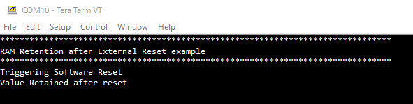

# RAM Retention after External Reset

**This code example checks RAM Retention mode after External Reset occurs.**  

## Device

The device used in this code example is:
- [TRAVEO™ T2G CYT4DN Series](https://www.infineon.com/cms/en/product/microcontroller/32-bit-traveo-t2g-arm-cortex-microcontroller/32-bit-traveo-t2g-arm-cortex-for-cluster/traveo-t2g-cyt4dn/)

## Board

The board used for testing is:
- TRAVEO&trade; T2G Cluster 6M Lite Kit ([KIT_T2G_C-2D-6M_LITE](https://www.infineon.com/cms/en/product/evaluation-boards/kit_t2g_c-2d-6m_lite/))

## Scope of work
The TRAVEO™ T2G MCU has a retention function for SRAM (Static Random-Access Memory), but after an external reset using the XRES_L pin occurs, the SRAM values cannot be retained correctly because the write buffer of the SRAM is not subject to retention. This example shows how to retain the SRAM value even after the MCU is reset by an external device.

## Introduction  

**SRAM Interface**  

- Optional memory size: 640 KB
- AXI bus interfaces:
    - In the fast clock domain for the CM7 CPUs
- AHB-Lite bus interface:
    - In the slow clock domain for all bus masters (CM0+ CPU, Crypto, P-DMA, M-DMA, debug interface, and optional external bus master). The slow bus infrastructure combines the bus masters in the slow clock domain.
- Programmable wait states.
- ECC function
    - Single-bit error correction and double-bit error detection (SECDED)
    - ECC error injection
- RAM retention function
- RAM power-up delay control
    - Setting the power stabilization wait after switching on the SRAM power domain.

**Reset System**  

TRAVEO™ T2G supports several types of resets that guarantee error-free operation during power up and allow the device to reset based on user-supplied external hardware or internal software reset signals. Resets have a broad scope and are generally aligned with power domains and global power modes. TRAVEO™ T2G has these reset sources:

- Power-on reset (POR) to hold the device in reset while the power supply is below the level required for initialization of startup circuits.
- Brownout detection reset (BOD) to reset the device if the power supply falls below the device specifications during normal operation.
- Over-voltage detection reset
- Over-current detection reset of the Active or DeepSleep regulator
- External reset (XRES_L) to reset the device using an external input
- Watchdog resets of the basic watchdog timer (WDT) and the multi-counter watchdog timers (MCWDT) to reset the device if the firmware execution fails to periodically service the watchdog timer
- Internal system reset to reset the device on demand using firmware
- Fault detection resets to reset the device if certain faults occur
- Clock-supervision resets to reset the device when clock-related errors occur
- Setting the power stabilization wait after switching on the SRAM power domain.

**Internal System Reset**  

The internal system reset is a mechanism that allows software running on any of the CPUs or a connected debugger to request a system reset. The Cortex-M0+ and Cortex-M7 Application Interrupt and Reset Control registers (CM0P_SCS_AIRCR and CM7_0/CM7_1_SCS_AIRCR, respectively) can request a reset by writing a ‘1’ to the SYSRESETREQ bit of the respective registers.

*Note that a value of 0x5FA should be written to the VECTKEY field of the AIRCR register before setting the SYSRESETREQ bit; otherwise, the processor ignores the write.*

More details can be found in:
- TRAVEO&trade; T2G CYT4DN
  - [Technical Reference Manual (TRM)](https://www.infineon.com/dgdl/?fileId=8ac78c8c8691902101869f03007d2d87)
  - [Registers TRM](https://www.infineon.com/dgdl/?fileId=8ac78c8c8691902101869ef098052d79)
  - [Data Sheet](https://www.infineon.com/dgdl/?fileId=8ac78c8c869190210186f0cceff43fd0)

## Hardware setup

This code example has been developed for:
- TRAVEO&trade; T2G Cluster 6M Lite Kit ([KIT_T2G_C-2D-6M_LITE](https://www.infineon.com/cms/en/product/evaluation-boards/kit_t2g_c-2d-6m_lite/)) 

**Figure 1. KIT_T2G_C-2D-6M_LITE (Top View)**

 
No changes are required from the board's default settings.

## Implementation

This code example uses software reset instead of an external reset using XRES_L pin. The example writes known data into SRAM Controller 1 and configures the GPIO to detect its falling edge as an interrupt. In the handler function of the interrupt, it flushes the content contained in write buffer of SRAM before issuing software reset. After the reset, data written to SRAM Controller 1 is read back and compared to the data written before software reset was triggered to check if the data is retained.  All the procedures are implemented on CM0+ core.

**SRAM configuration**  

- After in system initialization in main function is completed, cause for reset is get using <a href="https://infineon.github.io/mtb-pdl-cat1/pdl_api_reference_manual/html/group__group__syslib__functions.html#gac8aa61d2f8052886c676f4f592d1693d"><i>Cy_SysLib_GetResetReason()</i></a>
    - If the cause of the reset is anything other than software reset, the reset cause is cleared by <a href="https://infineon.github.io/mtb-pdl-cat1/pdl_api_reference_manual/html/group__group__syslib__functions.html#gaebb4e952584f0c428f58f7b4dbd3ceff"><i>Cy_SysLib_ClearResetReason()</i></a>, then known data is written to SRAM_CONTROLLER1 memory location (0x28040000 to 0x2807FFFF).
    - If the cause of the reset is due to software reset, then SRAM is put in enabled mode. In enabled mode, the data written in SRAM_CONTROLLER1 memory location is read back to check if data is retained or not. The result is then printed on the terminal and the loop starts again.

**GPIO Interrupt**  

The user button is configured as an interrupt source and controlled by PDL (Peripheral Driver Library) functions.
- <a href="https://infineon.github.io/mtb-pdl-cat1/pdl_api_reference_manual/html/group__group__gpio__functions__init.html#gad61553f65d4e6bd827eb6464a7913461"><i>Cy_GPIO_Pin_Init</i></a> initialize user button 1.
- <a href="https://infineon.github.io/mtb-pdl-cat1/pdl_api_reference_manual/html/group__group__sysint__functions.html#gab2ff6820a898e9af3f780000054eea5d"><i>Cy_SysInt_Init()</i></a> and <a href="https://infineon.github.io/mtb-pdl-cat1/pdl_api_reference_manual/html/group__group__gpio__functions__interrupt.html#ga0a32bd22c79ffcea82ce97ac73d1a6da"><i>Cy_GPIO_SetInterruptMask()</i></a> initialize user button events that generate button interrupts whenever user button 1 is pressed. And *NVIC_EnableIRQ()* function enables it.
- *Handle_GPIO_Interrupt()* function is the button ISR where, first the write buffer of the SRAM is flushed. Then, SRAM Retention mode is enabled. This is done by setting *CPUSS_RAM1_PWR_CTL_PWR_MODE* field of *RAM1_PWR_CTL* register. Finally, *__NVIC_SystemReset()* issues software reset.

**Miscellaneous settings**  

- **STDOUT setting**

  - Calling <a href="https://infineon.github.io/retarget-io/html/group__group__board__libs.html#ga21265301bf6e9239845227c2aead9293"><i>cy_retarget_io_init()</i></a> function to use UART as STDIN / STDOUT
    - Initialize the port defined as *CYBSP_DEBUG_UART_TX* as UART TX, defined as *CYBSP_DEBUG_UART_RX* as UART RX (these pins are connected to KitProg3 COM port)
    - The serial port parameters become to 8N1 and 115200 baud

## Run and Test

For this code example, a terminal emulator is required for displaying outputs. Install a terminal emulator if you do not have one. Instructions in this document use [Tera Term](https://teratermproject.github.io/index-en.html).

After code compilation, perform the following steps to flashing the device:

1. Connect the board to your PC using the provided USB cable through the KitProg3 USB connector.
2. Open a terminal program and select the KitProg3 COM port. Set the serial port parameters to 8N1 and 115200 baud.
3. Program the board using one of the following:
    - Select the code example project in the Project Explorer.
    - In the **Quick Panel**, scroll down, and click **[Project Name] Program (KitProg3_MiniProg4)**.
4. After programming, the code example starts automatically.

5. Press user button 1 to trigger software reset and confirm that the messages are displayed on the UART terminal.

    - *Terminal output on program startup* 

6. You can debug the example to step through the code. In the IDE, use the **[Project Name] Debug (KitProg3_MiniProg4)** configuration in the **Quick Panel**. For details, see the "Program and debug" section in the [Eclipse IDE for ModusToolbox™ software user guide](https://www.infineon.com/dgdl/?fileId=8ac78c8c8929aa4d0189bd07dd6113f9).

**Note:** **(Only while debugging)** On the CM7 CPU, some code in *main()* may execute before the debugger halts at the beginning of *main()*. This means that some code executes twice: once before the debugger stops execution, and again after the debugger resets the program counter to the beginning of *main()*. See [KBA231071](https://community.infineon.com/t5/Knowledge-Base-Articles/PSoC-6-MCU-Code-in-main-executes-before-the-debugger-halts-at-the-first-line-of/ta-p/253856) to learn about this and for the workaround.

## References  

Relevant Application notes are:

- [AN235305](https://www.infineon.com/dgdl/?fileId=8ac78c8c8b6555fe018c1fddd8a72801) - Getting started with TRAVEO&trade; T2G family MCUs in ModusToolbox&trade;
- [AN219842](https://www.infineon.com/dgdl/?fileId=5546d462749a7c2d01749b35aaf90cee) - How to Use Interrupt in TRAVEO&trade; II
- [AN220152](https://www.infineon.com/dgdl/?fileId=5546d462749a7c2d01749b35f7020cfa) - How to Retain RAM Data in Reset Procedure and Low-Power Mode Transition in TRAVEO&trade; II Family

ModusToolbox™ is available online:
- <https://www.infineon.com/modustoolbox>

Associated TRAVEO™ T2G MCUs can be found on:
- <https://www.infineon.com/cms/en/product/microcontroller/32-bit-traveo-t2g-arm-cortex-microcontroller/>

More code examples can be found on the GIT repository:
- [TRAVEO™ T2G Code examples](https://github.com/orgs/Infineon/repositories?q=mtb-t2g-&type=all&language=&sort=)

For additional trainings, visit our webpage:  
- [TRAVEO™ T2G trainings](https://www.infineon.com/cms/en/product/microcontroller/32-bit-traveo-t2g-arm-cortex-microcontroller/32-bit-traveo-t2g-arm-cortex-for-cluster/traveo-t2g-cyt4dn/#!trainings)

For questions and support, use the TRAVEO™ T2G Forum:  
- <https://community.infineon.com/t5/TRAVEO-T2G/bd-p/TraveoII>  
